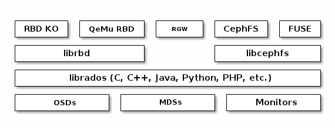
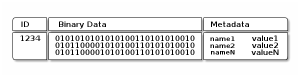
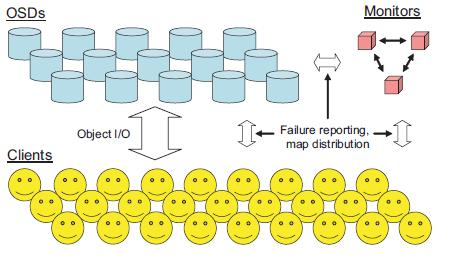
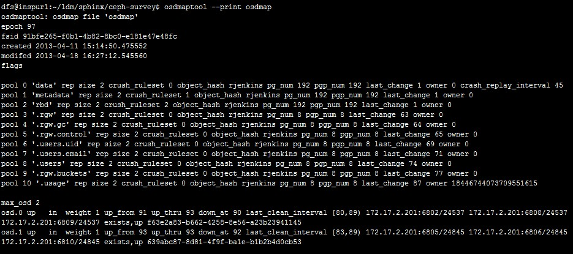
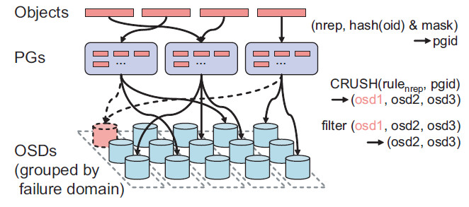
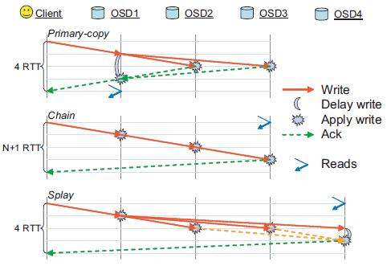
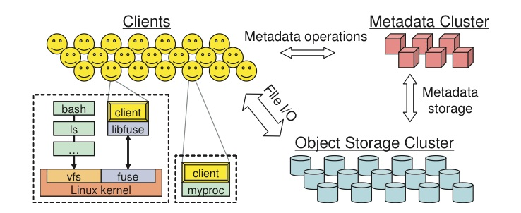

++++++++++++
Architecture
++++++++++++

Overview
========

Ceph是分布式存储领域的集大成者，统一提供以下服务：对象存储(object)，块设备存储(block)，文件存储(file)。具有高可用、便于维护、开源免费等特性，能有效帮助企业整合IT基础设施，管理海量数据。Ceph能够利用通用硬件搭建集群，且具有非凡的扩展能力，支持上千客户端同时访问P级别的数据。集群监视器(monitor)与后端存储节点(object storage node)之间的动态交互，保证了数据的均衡分布和整个集群平滑运行。

.. image:: _static/stack.png

**Ceph最大的特点**

#. **One Object Storage:** 数据统一放入名为RADOS的对象存储空间，客户端使用不同的接口来访问这些对象数据。客户端包括：CephFS filesystems，Ceph RADOS Gateways，Ceph Block Devices。
#. **Many Storage Interface:** 可以使用以上任意客户端访问数据，数据是统一的，因此没有必要为每一种访问方式提供不同的底层数据。
#. **Use Commodity Hardware:** 搭建Ceph平台无需昂贵的硬件，只需普通通用硬件即可。

Ceph基于RADOS对象存储系统实现了无限扩容，可以看这篇论文了解更多，\ `RADOS - A Scalable, Reliable Storage Service for Petabyte-scale Storage Clusters <http://ceph.com/papers/weil-rados-pdsw07.pdf>`_\。通过将RADOS服务封装成librados提供给上层调用，并基于librados实现了三类服务接口：

#. **Block Device:** 块设备(RBD: Rados Block Device)，支持Kernal Object(KO)和QEMU hypervisor的方式
#. **RESTful Gateway:** RADOS Gateway(RGW)提供了兼容Amazon S3和OpenStack Swift RESTful API接口。
#. **Ceph FS:** CephFS在内核层提供兼容POSIX文件系统接口(同ext3/ext4等内核文件系统)，另外，基于FUSE还实现了用户层文件系统。

Ceph作为对象存储系统，用户可以通过RBD，RGW，CephFS或者使用librados自定义客户端来进行对象交互，一个对象对应文件系统中的一个文件(不确定？原文是:  Each object corresponds to a file in a filesystem, which is typically stored on a single storage disk)。通过ceph-osd daemons进行磁盘文件读写操作。下图是对象、文件、磁盘的对应关系。

.. image:: _static/ditaa-518f1eba573055135eb2f6568f8b69b4bb56b4c8.png

OSDs存储对象是一个水平空间，是没有目录结构的。对象由标识符(Identify)、二进制数据、以及一组name/value元数据对组成。元数据对的语意取决于上层实现客户端实现，例如：CephFS存 file owner, created date, last modified date 等类似信息。

元数据集群MDS，分布式对象存储系统RADOS是Ceph最关键的两项技术。其中RADOS是一个支持海量存储对象的分布式对象存储系统。RADOS最大的特色是使用CRUSH算法维护存储对象与存储服务器的对应关系，并采用了无Master设计，对象复制，集群扩容，数据迁移，故障检测和处理能复杂功能由OSD提供，既避免了单点失败，又提升了集群扩展性。这里应用余利华的调研文章《RADOS分布式对象存储原理简介》和孙建良的调研文章《Ceph Master动态子树分析》分别介绍这两个部分。

Rados
=====

RADOS系统主要由两个部分组成：

#. 由数目可变的大规模OSDs（Object Storage Devices）组成的机群，负责存储所有的Objects数据。
#. 由少量Monitors组成的强耦合、小规模机群，负责管理Cluster Map，其中Cluster Map是整个RADOS系统的关键数据结构，管理机群中的所有成员、关系、属性等信息以及数据的分发。

对于RADOS系统，节点组织管理和数据分发策略均有内部的Monitors全权负责，所以，从Clients角度设计相对比较简单，它给应用提供的仅为简单的存储接口。

Cluster Map
^^^^^^^^^^^

Cluster Map是描述OSD状态信息以及集群拓扑结构的元数据信息。OSD状态涉及 **up/down** 和 **in/out** 两个维度， **up/down** 表示OSD是否工作正常， **in/out** 表示OSD是否包含有效数据。

#. **<up, in>:** 状态表示OSD工作正常且包含有效的PG。
#. **<up, out>:** 表示OSD工作正常，但是尚未包含任何有效PG（有点类似hot spare）。
#. **<down, in>:** 表示OSD临时性故障。
#. **<down, out>:** 代表节点永久性故障。

OSD通过相互发送心跳消息检测故障，故障信息汇报到高可用的monitor集群，由monitor来修改Cluster Map。(理论上两个节点有可能同时汇报对方故障，不知monitor是如何处理这种情况的？？)

Cluster Map是数据定位的关键数据结构，因此复制到所有client和OSD上。Cluster Map带一个版本号信息epoch，请求和响应中带有epoch信息，用于验证校验请求方和响应方看到一致的Cluster Map，当epoch不匹配时，请求失败，并且epoch较大的一方发送cluser Map增量更新到epoch较小的一方。由于存在复制关系的OSD之间定期发送心跳消息，Cluster Map能够迅速扩散到整个集群。

在大规模的分布式系统中，OSDs的Failures/Recoveries是常见的，所以，Cluster Map的更新就比较频繁，如果将整个Cluster Map进行分发或广播显然会造成资源的浪费，RADOS采用分发Incremental Map的策略避免资源浪费，其中Incremental Map仅包含了两个连续epoch之间Cluster Map的增量信息。

下面贴出测试环境中的Cluster Map，以便有个直观印象

定位对象
^^^^^^^^

RADOS采用两层映射关系，\ **第一层映射**\将存储对象映射到一个\ **PG(Placement Group)**\，PG是一组存储对象集合，是\ **复制和负载均衡的最基本单位**\。一级映射\ **pgid = hash(o) & m**\的输入是\ **对象标识o**\，以及\ **掩码m**\，m限定系统内最大PG个数为2的整数次幂（实际上是三个参数，这里忽略副本个数r）。虽然限定了最大PG个数，但是不对系统扩容造成影响，原因是PG可以一分为二。但是同时将所有PG分裂造成大量数据迁移，为避免这种情况，使用类似\ `linear hashing <http://en.wikipedia.org/wiki/Linear_hashing>`_ 的方式对一级映射做了修正，允许每次只分裂一个PG，可以实现渐进式扩容。

**第二层映射**\是基于\ `CRUSH <http://ceph.com/papers/weil-crush-sc06.pdf>`_ (Controlled Replication Under Scalabe Hashing)哈希算法\ **映射PG到多个OSD，这些OSD构成复制关系**\。CRUSH的输入是：Cluster Map， placement rule，pgid。

#. **Cluster Map：**\描述集群中所有OSD信息、状态及其逻辑关系。
#. **placement rule：**\限定了副本个数，以及副本放置规则，例如所有副本必须放在不同机架。
#. **pgid：**\是PG标识符

与普通哈希不同，CRUSH较为稳定，增加或者减少OSD，不会导致大量数据迁移，此外CRUSH允许根据OSD存储能力，设定权重。以PG作为复制和负载均衡的基本单位，有两个好处，一是有效减小复制的管理难度，二是对错误进行一定程度隔离（一个OSD故障影响到有限个其他OSD）。 当然，为了保证数据可靠性，必须控制PG大小，提搞恢复并行度， 保证集群内部有充足的资源参与恢复。

**基于PG和CRUSH的存储对象定位方式是RADOS比较重要的一个创新点，无须全局维护对象到OSD之间的映射关系，集群中任何服务器，无论是client异或是OSD， 均能独立完成数据定位。其优缺点如下：**

**主要优势：**

#. 元数据小，支持海量小文件存储，系统扩展性非常好。
#. 支持对等集群，将复制、故障检测、故障处理交给智能OSD处理。
#. 算法较为灵活，能支持权重和placment rule。

**不足之处：**

#. 负载均衡不够灵活，服务器性能差异较大时，难以设置合理的权重。
#. 新节点加入集群时，必须迁移数据。

.. 由于PG数量较大，这里给出测试环境的PG示例，点击\ `链接<./_static/pg.txt>`_

由于PG数量较大，这里给出测试环境的PG示例，点击 :download:`pg.txt <_static/pg.txt>`

复制方案
^^^^^^^^

RADOS实现了三种不同的Replication方案，如下图

#. **Primary-copy：** 读写操作均在primary OSD上进行，并行更新replicas；读写操作都发往primary，primary确定写操作的顺序并转发到所有其他副本，等到其他副本写操作完成之后，primary写本地对象，然后返回ack到客户端。（由于存在并发访问可能性，必须从primary读取数据，否则可能读到不一致数据）。
#. **Chain：** 链式读写，读写分离；类似Google文件系统，OSD构成一个链，写请求发往第一个OSD，该OSD执行写操作之后转发请求到后一个OSD，最后一个OSD完成写操作之后发送ack到客户端。读请求发往最后一个OSD，保证读到的数据都有充足的副本。
#. **Spaly：** Primary-copy和Chain的折中方案：并行更新replicas和读写分离。

primary-copy是最常用的复制方式，因此本文只关注这种方式。下图是流程图示：

.. image:: _static/ditaa-54719cc959473e68a317f6578f9a2f0f3a8345ee.png

数据一致性
^^^^^^^^^^

**RADOS基于版本和日志实现副本一致性**\。每个存储对象对应一个版本(epoch, v)，其中epoch是Cluster Map版本，v是递增的数字，每次写操作都会增加v。PG也对应一个最后更新版本last_update， last_update等于PG中最新修改对象的版本。每个PG都记录近期更新日志，日志项包括存储对象名，操作类型，版本对象版本和客户端标识。在RADOS中， 一次更新操作涉及写log，修改版本，修改数据几个动作，EOBFS通过事务保证log与数据的一致性。

写操作过程跳过不可用的副本，这可能导致不一致，一致性恢复分为两个阶段：第一个阶段是peering。这一阶段的目的是让所有副本得到PG最新状态，所有相关OSD向primary汇报最近一段时间的log，primary汇集自上次peering以来的所有更新日志，并将增量日志发往所有其他副本。第一阶段阻塞读写请求，一般来说peering较为轻量级，对可用性影响不算大。 第二个阶段是恢复阶段，primary根据各副本状态从其他副本拷贝存储对象或者发送存储对象到其他副本。恢复阶段与应用IO可以并行，若应用访问了primary中待恢复的存储对象，则将对象恢复优先级提高，并阻塞请求指导该对象恢复完成。

RADOS只保存也只能保存最近一段时间内的更新， 新节点加入集群或者节点永久性故障时，某些副本需要从零开始全量恢复，解决办法是扫描PG内所有存储对象，生成backlog，根据backlog和近期log完成恢复。

读写请求带有epoch，只有epoch匹配时才允许更新，若不匹配响应方返回cluster map增量更新，请求方重新确定副本位置。只要参与更新的OSD和client具有相同的epoch，即使这个epoch与cluster map最新epoch不同更新也能成功，也能保证一致性，原因是此时新的primary还没开始peering，不会产生丢失更新问题。

读操作的一致性难以保证，譬如网络故障情况将某个client和primary于其他副本隔离，而且primary已经被cluster map标记为down，由于primary和client之间的网络是正常的，该client的读请求总是能执行成功。为了尽可能降低这种情况出现，primary和其他副本之间定期发送心跳， 若primary一段时间未接收到其他副本的心跳消息，则阻塞读操作。虽然读操作存在不一致，但是产生的概率比较小，实际上，只要这段时间内单个存储对象上没有读写并发， 则读操作还是能保证一致。

**关于复制和一致性， 几个问题不甚清楚：** 

#. 读写必须有primary参与，primary出错时，如何保证可用性？ 是否等到primary故障被检测到，并且新的primary完成peering之后才允许读写，不可用时长是多少？
#. 写操作遇到epoch不匹配时如何处理？  譬如， primary先写成功了第二个副本， 而写第三个副本时发现epoch不匹配。 primary拿到新的cluster map之后，是否需要撤销第二个副本的更新？ 怎么保证一致性？
#. peering时遇到全量恢复情况，可用性是否受较大影响？

底层存储机制
^^^^^^^^^^^^

如上所述，RADOS通过对象版本和操作日志修复副本一致性，这种做法能够提高修复效率，以及系统可用性，但也对单机存储系统提出更高要求：日志，对象版本，对象数据必须保持一致。 

RADOS原生的本地存储系统\ `EBOFS <http://goo.gl/so4Ws>`_\ (Extent and B-Tree based Object File System)，是基于Extent和B-Tree的单机对象存储系统，提供类似文件系统的对象访问接口，对象归属于一个或者多个collection，对象和collection拥有多个attribute/value元数据。Extent是连续的一段存储空间，基于Extent分配和管理空闲空间，可以降低元数据数据量，降低数据碎片，提高数据的连续性，提升IO效率。使用COW技术处理更新， 能够保证磁盘数据一致性，降低宕机恢复难度。EBOFS先在内存做更新，再异步写回磁盘。基于COW和内存更新，EOBFS实现了事务功能，能够保证对象，对象版本，PG last_update, PG操作日志之间的一致性。此外EBOFS提供了journal功能，journal存储于NVRAM，用于对持久化要求较高的应用。 

Btrfs是一个基于COW B-Tree的文件系统，Btrfs功能比EBOFS更为强大(支持文件数据COW，同时文件元数据不必全部装入内存)，2.6.29之后btrfs已经进入linux内核mainline。 为了避免重复发明轮子，官方文档推荐使用btrfs作为ceph的本地存储系统。不清楚btrfs是否提供类似EBOFS的事务特性。

Monitor
=======

Monitors是Cluster Map主备份存储目标，所有其他位置上的Cluster Map最初都是从Monitors请求得到。Monitors通过对Cluster Map的周期更新升级实现存储机群的管理。Monitor的工作分两个阶段：

#. 首先在多个Monitors中选举Leader，之后Leader向所有Monitors请求Map Epoch，Monitors周期性向Leader汇报结果并告知其活跃(Active Monitor)，Leader统计Quorum。这阶段的意义是保证所有的Monitors的Map Epoch都是最新的，通过Incremental updates对已失效的Cluster Map进行更新。
#. Leader周期向每一个Active Monitor授权许可提供分发Cluster Map副本给OSDs和Clients的服务。当授权失效但Leader仍没有重新分发认为Leader died，此时重回第一阶段进行Leader重选；当Active Monitor没有周期向Leader反馈ACK则认为有Monitor died，重回第一阶段进行Leader选举并更新Quorum。Leader周期分发Lease和Active Monitor周期反馈ACK的另外一个作用是同步Monitors的Cluster Map。Active Monitor收到Update请求时，首先验证当前的Epoch是否为最新，如果不是，更新后向上汇报到Leader，Leader分发给所有的Monitors，同时回收授权，重新开始新一轮的Leader选举到Cluster Map服务。

通常Monitor的负载比较小：OSDs上的Cluster Map更新通过OSDs之间的机制实现；OSDs的状态变化比较罕见不会对Monitors的负载造成影响。但是一些特殊情况可能会对Monitors负载带来影响，比如：同时有n OSDs failed，每一个OSD store m个PGs，此时会形成m×n个failure report到达Monitors，对于规模较大的机群这样的数据量比较大。为避免这种情况给Monitor带来的负载压力，OSDs采用伪随机的时间间隔交错安排failure检测(此处是从OSDs到Monitor的检测)向上汇报，另外根据Monitors的并行化和负载均衡分配的特点，扩展Monitors是解决Monitors的负载压力的另一措施。

Master
======

TBD
