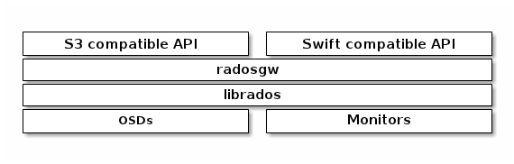

+++++++++
Implement
+++++++++

S3 GetBucket Prefix & Delimiter
===============================

从下图就能够看出，radosgw调用librados实现了S3和Swift兼容接口，前文我们介绍过librados接口，只有简单的对象list操作，没有对此进行任何优化，为了弄清S3兼容接口中GetBucket Prefix Delimiter的实现，我们对代码进行了分析。

最上层调用的是\ **RGWListBucket::execute()**

.. code-block:: c
    :linenos:
     
    void RGWListBucket::execute()
    {
      string no_ns;

      ret = get_params();
      if (ret < 0)
        return;

      // list_objects传入prefix delimiter等参数，返回对象列表objs和common_prefixes列表
      ret = store->list_objects(s->bucket, max, prefix, delimiter, marker, objs, common_prefixes,
                                   !!(s->prot_flags & RGW_REST_SWIFT), no_ns, &is_truncated, NULL);
    }

**list_object**\函数的作用是调用\ **cls_bucket_list**\，得到前缀是prefix参数的对象列表，并对这些对象进行去common_prefix的操作，该操作用find查找delimiter，对于那些common_prefix下有超级多delimiter符合条件的查询，代价很大，几乎不能在online work，断定Ceph实现的GetBucket只是一个花架子而已。

.. code-block:: c
    :linenos:
     
    /** 
     * get listing of the objects in a bucket.
     * bucket: bucket to list contents of
     * max: maximum number of results to return
     * prefix: only return results that match this prefix
     * delim: do not include results that match this string.
     *     Any skipped results will have the matching portion of their name
     *     inserted in common_prefixes with a "true" mark.
     * marker: if filled in, begin the listing with this object.
     * result: the objects are put in here.
     * common_prefixes: if delim is filled in, any matching prefixes are placed
     *     here.
     */
    int RGWRados::list_objects(rgw_bucket& bucket, int max, string& prefix, string& delim,
                   string& marker, vector<RGWObjEnt>& result, map<string, bool>& common_prefixes,
                   bool get_content_type, string& ns, bool *is_truncated, RGWAccessListFilter *filter)
    {
      int count = 0;
      bool truncated;

      if (bucket_is_system(bucket)) {
        return -EINVAL;
      }
      result.clear();

      rgw_obj marker_obj;
      marker_obj.set_ns(ns);
      marker_obj.set_obj(marker);
      string cur_marker = marker_obj.object;

      do {
        std::map<string, RGWObjEnt> ent_map;

        // cls_bucket_list 函数传入prefix，表示返回对象的前缀，cur_marker标识每次list的开始位置
        int r = cls_bucket_list(bucket, cur_marker, prefix, max - count, ent_map,
                                &truncated, &cur_marker);
        if (r < 0)
          return r;

        std::map<string, RGWObjEnt>::iterator eiter;
        for (eiter = ent_map.begin(); eiter != ent_map.end(); ++eiter) {
          string obj = eiter->first;
          string key = obj;

          if (!rgw_obj::translate_raw_obj_to_obj_in_ns(obj, ns)) {
            if (!ns.empty()) {
              /* we've iterated past the namespace we're searching -- done now */
              truncated = false;
              goto done;
            }

            /* we're not looking at the namespace this object is in, next! */
            continue;
          }

          if (filter && !filter->filter(obj, key))
            continue;

          if (prefix.size() &&  ((obj).compare(0, prefix.size(), prefix) != 0))
            continue;

          if (!delim.empty()) {

            // 看这里，delimiter的关键，居然是把每个prefix出来的key进行一次find操作
            // 有够啃爹的
            int delim_pos = obj.find(delim, prefix.size());

            if (delim_pos >= 0) {

              // 放入common_prefix这个map
              common_prefixes[obj.substr(0, delim_pos + 1)] = true;
              continue;
            }
          }

          RGWObjEnt ent = eiter->second;
          ent.name = obj;
          result.push_back(ent);
          count++;
        }
      } while (truncated && count < max);

    done:
      if (is_truncated)
        *is_truncated = truncated;

      return 0;
    }
