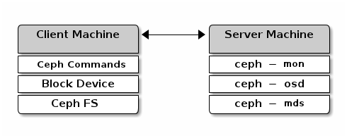

++++++++++++
Installation
++++++++++++

Ceph主页贴心的为使用者提供了快速搭建方案，只需两台Ubuntu(或者Debian)主机，就能搭建起整个Ceph运行环境，详见\ `链接 <http://ceph.com/docs/master/start/quick-start/>`_\，下图是系统搭建完成后节点上的服务运行情况。

**服务端组件包括：** 一个mds节点，一个monitor节点，两个object storage节点。

**客户端组件包括：** 命令行工具，块设备，Ceph FS(可以组合使用，因为底层共用一套存储系统)。

**这里有以下几点需要说明**

#. 官网上说最好Client和Server使用不同的主机，实际本人测试发现放在一起没有什么问题，可能没有触发到有问题的点。
#. 如果仅仅是试用librados，是不需要部署mds的。
#. 设备驱动程序和Linux内核文件系统对Ceph的支持，要求内核版本在2.6.34以上。

**安装完成后，启动ceph各节点**

.. code-block:: java
	:linenos:

	root  23921  0.0  0.1 145616 14248 ?  Ssl  Apr18   1:50 /usr/bin/ceph-mon -i a --pid-file /var/run/ceph/mon.a.pid -c /etc/ceph/ceph.conf
	root  24114  0.0  0.1 171204 15056 ?  Ssl  Apr18   1:48 /usr/bin/ceph-mds -i a --pid-file /var/run/ceph/mds.a.pid -c /etc/ceph/ceph.conf
	root  24539  0.0  0.4 414432 35892 ?  Ssl  Apr18   4:20 /usr/bin/ceph-osd -i 0 --pid-file /var/run/ceph/osd.0.pid -c /etc/ceph/ceph.conf
	root  24847  0.0  0.4 424672 37092 ?  Ssl  Apr18   4:36 /usr/bin/ceph-osd -i 1 --pid-file /var/run/ceph/osd.1.pid -c /etc/ceph/ceph.conf
	dfs   24244  0.0  0.0 1227888 7096 ?  Ssl  Apr18   6:40 radosgw -c /etc/ceph/ceph.conf -n client.radosgw.gateway
	root  24551  0.0  0.1 132396  8640 ?  Sl   Apr18   2:53 ceph-fuse -m 172.17.2.201:6789 /home/dfs/ldm/ceph/mp

#. 其中，1~4行是服务端进程，5~6行是客户端进程。
#. 服务端进程中，至少需要两个存储节点，这是由于Ceph需要对数据进行多备份。
#. 客户端只部署了两类，1)基于fuse的POSIX兼容文件系统；2)兼容S3和Swift的RadosGateway。
#. 客户端还支持内核Ceph文件系统、块设备，但是需要Linux内核版本在2.6.34以上，我们的服务器版本不够，所以暂时先不折腾。
#. Ceph官方推荐使用块设备或者Rados Gateway，声称这两种客户端类型已经达到生产环境要求。
